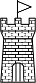

<h1 align="center">
    
     
</h1>

<h1 style="font-weight:bold" align="center">CASL</h1>

<h2 style="font-weight:bold" align="center" >!! NOTICE !!</h2>

This library is still under development and is not at v1.0.0 yet!!  However, all of the major features are available, so we encourage you to use it and provide feedback.  That is what open source is all about. 🥳

<h2 style="font-weight:bold" align="center">📖 About CASL 📖</h2>

Pronounced *Castle*, **CASL** is an acronym for (C)ross-platform (A)udio and (S)ound (L)ibrary

**CASL** is a cross-platform dotnet library for playing and managing sounds powered by **OpenAL 1.1** using software rendering.  This is accomplished by using low-level bindings to the native **OpenAL** library.

This can be used for applications such as video games, and sound players, and will work on any dotnet compliant platform.
> **Note** Cross-platform work is still a WIP, but works fine with windows.

<h2 style="font-weight:bold" align="center">✨ Features ✨</h2>

### Audio Formats

Currently, this library can play **.ogg** and **.mp3** file formats.  There are plans to support **.wav** files in the future as well as other possible sound formats.

### Cross-Platform

We strive for **CASL** to be a cross-platform library by running under the latest possible dotnet version.  

<h2 style="font-weight:bold;" align="center">🙏🏼 Contributing 🙏🏼</h2>

Interested in contributing? If so, click [here](https://github.com/KinsonDigital/.github/blob/master/docs/CONTRIBUTING.md) to learn how to contribute your time or [here](https://github.com/sponsors/KinsonDigital) if you are interested in contributing your funds via one-time or recurring donation.

<h2 style="font-weight:bold;" align="center">🔧 Maintainers 🔧</h2>

- [Calvin Wilkinson](https://twitter.com/KDCoder) (KinsonDigital GitHub Organization - Owner)
- [Kristen Wilkinson](https://twitter.com/kswilky) (KinsonDigital GitHub Organization - Project Management, Documentation, Tester)

 

<h2 style="font-weight:bold;" align="center">🚔 Licensing And Governance 🚔</h2>

This software is distributed under the very permissive [MIT license](https://github.com/KinsonDigital/.github/blob/release/v1.0.0/LICENSE.md) and all dependencies are distributed under MIT-compatible licenses.
This project has adopted the code of conduct defined by the **Contributor Covenant** to clarify expected behavior in our community.
